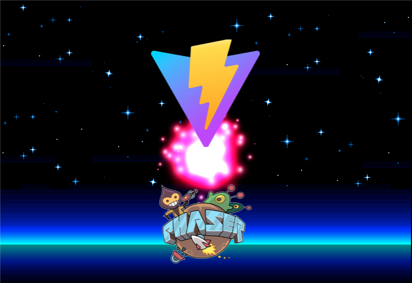

# Vite Phaser Typescript Template

Projectile V2 is a study of projectile mechanics in games.

## Preview



## Getting Started

```bash
npm i
npm run dev
```

## Available scripts

### To run the project

```bash
npm run dev
```

### To build the project

```bash
npm run build
```

### To preview the build

```bash
npm run preview
```

### To lint check your code using eslint

```bash
npm run lint
```

### To lint check and fix your code

```bash
npm run lint-fix
```

## Project structure

```
.
├── dist
├── node_modules
├── public
│    ├── assets
├── src
│   ├── scenes
│       ├── HelloScene.ts
│   ├── main.ts
├── index.html
├── package.json
```

`dist` your build will placed in this folder.\
`src` you can structure your codes and folder as you like inside this folder.\
`public` your static asset must be placed inside this folder. You can also
create new folder inside this folder.

## License

[MIT License](LICENSE.md)

